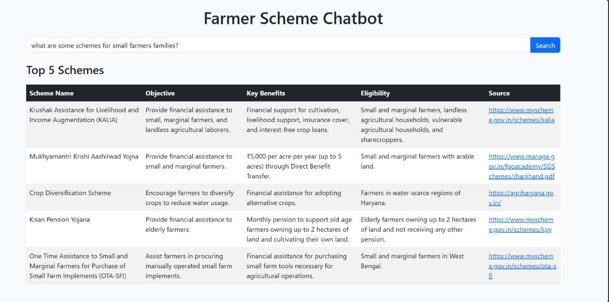

# 🌱 AgriChatBot – Government Scheme Retrieval System

AgriChatBot is a smart chatbot that helps farmers discover relevant **government agricultural schemes** by simply typing natural language queries.  
It uses **AI embeddings + FAISS similarity search** to match farmer queries with official scheme data.

---

## ⚡ Features
- Farmers can type queries like *"schemes for small farmers in Maharashtra"*.
- Retrieves relevant schemes based on **objective, benefits, eligibility**.
- Fast similarity search using **FAISS embeddings**.
- Simple web UI built with **Flask**.

---

## 🛠 Tech Stack
- **Python, Flask**
- **SentenceTransformers (MiniLM model)**
- **FAISS** (vector similarity search)
- **SQLite, Pandas**

---

## 🚀 How It Works
1. **Database Setup**  
   - Load CSV → Store schemes in SQLite (`database_setup.py`).  

2. **Embedding Generation**  
   - Generate text embeddings for schemes (`embedding.py`).  
   - Store them in FAISS index (`schemes_index.faiss`).  

3. **Query Processing**  
   - Convert user query to embedding.  
   - Search FAISS index for nearest schemes.  

4. **Chatbot Interface**  
   - Flask app (`chatbot.py`) with input box.  
   - Returns top matching schemes with details.

---

## Screenshots

## ▶️ Run Locally

# 1. Clone repository
git clone https://github.com/Harshal3459/InnovateYouAgriChatbot.git
cd InnovateYouAgriChatbot

# 2. Install dependencies
pip install -r requirements.txt

# 3. Setup database
python database_setup.py

# 4. Generate embeddings
python embedding.py

# 5. Run chatbot
python chatbot.py
